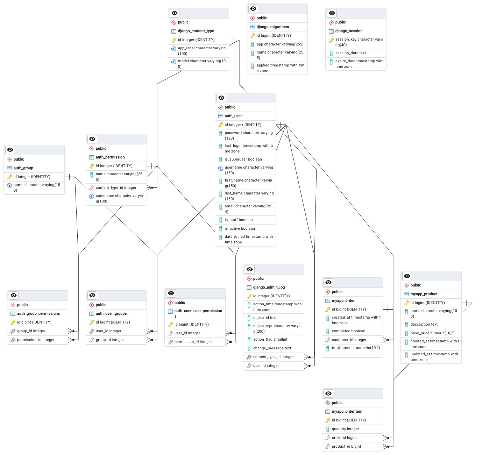

# Coffee Shop Ordering App

This is a Django-based application for a coffee shop that allows customers to log in, pre-order drinks, and view order summaries. The admin can manage products and view orders placed by customers.

## Link to repo
See the git repo. [Git Repo](https://github.com/RossElmes/youtubeplayer_django_delploy)  
See link to the [Coffee App](https://youtubeplayer-django-27h4.onrender.com)  

### Superuser Login    
Password:rossco123  
Username:ross 

## Features

### Customer Features

- **User Authentication**
  - Users can sign up, log in, and log out.
  - Password reset functionality.
  - Profile management for updating user information.

- **Product Ordering**
  - View a list of available products.
  - Add products to an order.
  - View an order summary 
  - Complete the order and view a summary on the confirmation page.

### Admin Features

- **Product Management**
  - Add new products.
  - Edit existing products.
  - Delete products.

- **Order Management**
  - View a list of all orders placed today.
  - Accept and complete orders.
  - View order details including products and total amount.

- **Email Recoivery**
- Receive an email for password rest 

## Models



- **Product**
  - Name
  - Description
  - Price

- **Order**
  - User
  - Total Amount
  - Completed (flag)

- **OrderItem**
  - Order
  - Product
  - Quantity

## Setup and Installation

1. **Clone the repository:**
    ```bash
    git clone https://github.com/your-username/coffee-shop-ordering-app.git
    cd coffee-shop-ordering-app
    ```

2. **Create and activate a virtual environment:**
    ```bash
    python -m venv venv
    source venv/bin/activate  # On Windows use `venv\Scripts\activate`
    ```

3. **Install the dependencies:**
    ```bash
    pip install -r requirements.txt
    ```

4. **Set up the database:**
    ```bash
    python manage.py migrate
    ```

5. **Create a superuser:**
    ```bash
    python manage.py createsuperuser
    ```

6. **Run the development server:**
    ```bash
    python manage.py runserver
    ```

7. **Access the application:**
    - Open your web browser and go to `http://127.0.0.1:8000/` to view the app.
    - Go to `http://127.0.0.1:8000/admin/` to access the admin panel.

## Usage

1. **Sign Up and Log In**
   - Users can sign up for an account and log in to place orders.

2. **Place an Order**
   - Browse products and add them to the order.
   - Complete the order and view the confirmation page.

3. **Admin Actions**
   - Manage products from the admin panel.
   - View and manage orders.

## Deployment to Render

### Prerequisites

I have sumarised the [how to guide](https://docs.render.com/deploy-django) below. 
I leverage this to create a [super user on deployed app](https://community.render.com/t/is-it-possible-to-create-django-admin-account-with-free-plan/6972)

1. Ensure you have a Render account. Sign up at [Render](https://render.com/).
2. Ensure your project is hosted on GitHub.

### Steps

1. **Create a New Web Service on Render**

    - Go to the Render dashboard.
    - Click on the "New" button and select "Web Service."
    - Connect your GitHub repository to Render.

2. **Configure the Service**

    - **Name**: Choose a name for your service.
    - **Branch**: Select the branch you want to deploy.
    - **Build Command**: Use `pip install -r requirements.txt`.
    - **Start Command**: Use `gunicorn coffee_shop_ordering_app.wsgi:application --bind 0.0.0.0:$PORT`.
    - **Environment**: Select `Python 3`.

3. **Set Environment Variables**

    - **DJANGO_SECRET_KEY**: Set this to a secure, random value.
    - **DATABASE_URL**: Set this to the URL of your database. Render can provide a PostgreSQL database URL if you create a PostgreSQL database service.
    - **DISABLE_COLLECTSTATIC**: Set this to `1` to disable collectstatic during the build.

4. **Add Post-deployment Scripts (if needed)**

    - In your Render service settings, add any necessary post-deployment scripts, such as database migrations:
      ```bash
      python manage.py migrate
      python manage.py collectstatic --noinput
      ```

5. **Deploy**

    - Click on "Create Web Service."
    - Render will start the deployment process, and your app will be live once the deployment is complete.

## Contributing

1. **Fork the repository**
2. **Create a new branch**
    ```bash
    git checkout -b feature-branch
    ```
3. **Make your changes and commit them**
    ```bash
    git commit -m "Description of your changes"
    ```
4. **Push to your branch**
    ```bash
    git push origin feature-branch
    ```
5. **Create a pull request**


## Contact

For any inquiries or support, please contact [your-email@example.com].
